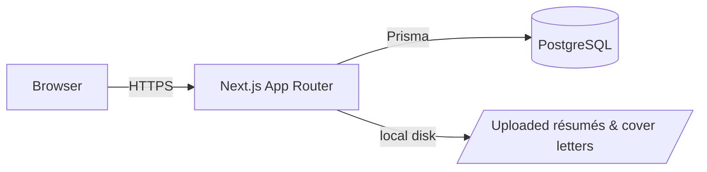
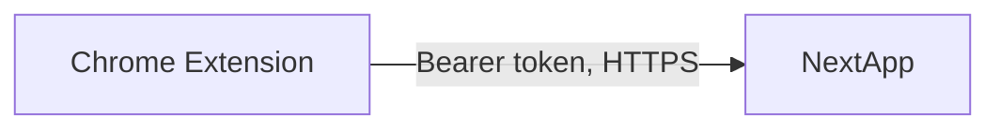
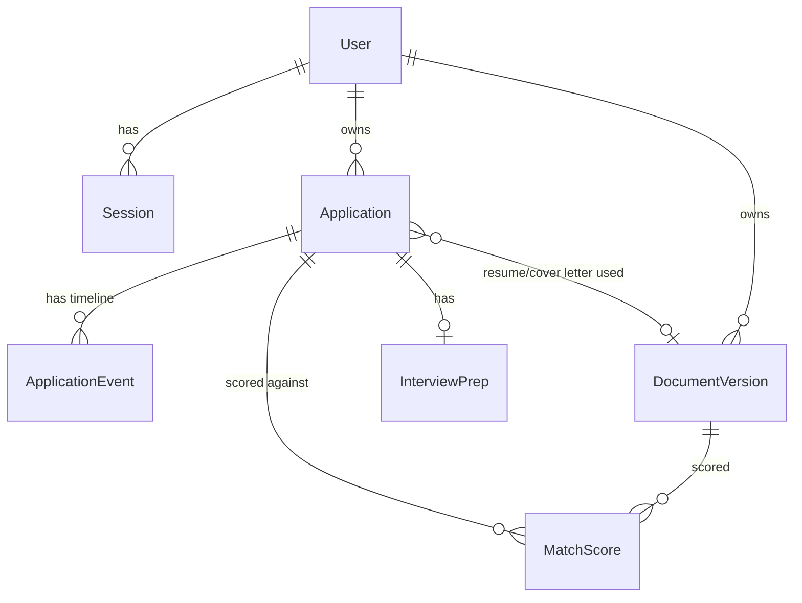

# Architecture

## Overview

Single Next.js application: API route handlers under `src/app/api/**` and the
UI under route groups `(auth)` and `(dashboard)` share one deployable unit,
one Postgres database, and one process. There is no separate backend service
to keep in sync for this milestone.

The `extension/` directory is a second, independent deployable — its own
`package.json`, build, and test suite (see `extension/README.md`) — that
talks to this app only through the versioned `/api/extension/*` REST
surface. It ships on its own schedule (a Chrome Web Store release) and isn't
part of the root `npm test`/`npm run build`.

## Why these choices

**Single app, not a monorepo.** The Chrome extension is its own deployable
folder calling this app's REST API — but the web app and its own API don't
need independent deploy schedules *from each other*, so splitting them into
separate services now would be premature structure with no present benefit.

**Custom session auth, not NextAuth.** Sessions are opaque 256-bit random
tokens; only their SHA-256 hash is stored (`Session.tokenHash`), so a
database leak alone never yields a usable session token. Logout / "sign out
everywhere" is a plain row delete — no JWT blacklist or expiry-window
reasoning required. Passwords are hashed with bcrypt (cost 12). See
`src/lib/auth.ts`.

**Row-level security enforced at the application layer, not the database.**
The self-hosted single-role Postgres connection can't rely on Supabase-style
RLS policies tied to a JWT claim. Instead, every model that carries `userId`
(`Application`, `DocumentVersion`) is only ever read or written through
`src/lib/repositories/*`, and every function in that layer takes `userId` as
a required parameter and folds it into the Prisma `where` clause. A route
handler that bypassed the repository layer and called `prisma.application.*`
directly would be the only way to break isolation — there is exactly one
place to audit for that. `MatchScore` and `InterviewPrep` don't carry
`userId` directly; ownership is checked by first loading the parent
`Application` scoped to `userId` (see `getApplicationOwnedByUser` in
`src/lib/repositories/matchScores.ts`). This invariant is proven, not just
asserted, by `src/lib/repositories/applications.integration.test.ts`.

**Local-disk storage behind an interface.** `src/lib/storage.ts` exposes
`put` / `get` / `delete`; the only implementation today writes to
`UPLOAD_DIR`. Swapping in S3-compatible storage later means writing one new
class, not touching any call site.

**Résumé and cover letter share one model (`DocumentVersion`, `type` enum)**
instead of two near-identical tables, so upload, versioning, and diffing
logic isn't duplicated.

**Match scoring is deterministic and local, not an LLM call.** `src/lib/match-score.ts`
tokenizes the job description and résumé, checks a curated list
(`src/lib/skills-dictionary.ts`) of skills/technologies for whole-word
matches in both texts, and separately extracts the most frequent
non-dictionary keywords from the job description. The score is
`matched skills / total JD skills`. This keeps scoring free, deterministic,
instant, and unit-testable — and the dictionary is the obvious extension
point for "add a new technology."

**The Chrome extension authenticates with a personal access token, not the
session cookie.** `ApiToken` is a second, narrower credential type (hashed
the same way as `Session`) that only the `/api/extension/*` routes accept
(`requireBearerUser` in `src/lib/current-user.ts`). Those routes can only
create a new `SAVED` application or check identity — a leaked extension
token can't read, edit, or delete anything, and can't be used against any
session-only route (they don't check the `Authorization` header at all).
Tokens are created/listed/revoked from the web app's `/settings` page, so
the extension never touches the user's password or session cookie. MV3
extension pages calling `fetch` from `optional_host_permissions` origins are
exempt from CORS, so no server-side CORS configuration was needed for this.

## Data model

- `User` — email/password (bcrypt hash)
- `Session` — hashed opaque token, expiry; deleting a row revokes it
- `Application` — the Kanban card: job info, `stage` enum, `resumeVersionId`
  / `coverLetterVersionId` pointers to the exact documents submitted
- `ApplicationEvent` — append-only timeline (stage changes + free-text notes)
- `DocumentVersion` — one row per uploaded résumé/cover-letter version, with
  extracted plain text for diffing/scoring
- `MatchScore` — cached result of scoring one `DocumentVersion` against one
  `Application`'s job description
- `InterviewPrep` — one-to-one with `Application`: company research,
  question lists, checklist, notes
- `ApiToken` — hashed personal access token for the Chrome extension; scoped
  to the narrow `/api/extension/*` surface only

## Deferred scope

Not built yet (each is a substantial system on its own):

- **Gmail integration** (read-only, auto stage updates from interview/rejection emails)
- **Google Calendar sync** for interviews
- **Notion export**
- **Weekly digest email**
- **Long-term insight mining** across applications (e.g. "AWS appears in 78% of your interview-stage applications")
- **Production monitoring/alerting** (parsing success rate, job failure rate)
- **CI/CD pipeline** and independent extension/backend release process

The data model already has the hooks these need (e.g. `Application.jobUrl`,
`dateCaptured` for extension capture; `MatchScore` history for insight
mining) without redesigning the core schema when they're built.

## Deployment: the Dockerfile defaults to production

`Dockerfile` is written for local `docker-compose` use (bind-mounted source,
hot reload) but is also what some hosts (Railway included) will build
directly if they detect it instead of using their own Node buildpack. Its
`CMD` branches on `NODE_ENV`: only `NODE_ENV=development` (what
`docker-compose.yml` sets explicitly) runs `next dev`; everything else,
**including `NODE_ENV` being unset**, runs a real `npm run build && npm
start`. This is deliberately the safer default — a host that builds from
this Dockerfile without setting `NODE_ENV` at all (some don't, unlike their
own buildpacks which typically default it to `production`) still gets a
migrated, production Next.js server, never the dev server serving against an
unmigrated database.

## Resolved: Next.js CVE exposure

An earlier version of this app ran Next.js 14.2.x, which `npm audit` flagged
at "high"/"critical" severity for several CVEs (unauthenticated RCE on
Windows-hosted servers, image-optimizer DoS, middleware/i18n edge cases).
The app has since been upgraded to Next.js 16 (with the required React 19
migration — `params`/`cookies()` are now async throughout), which is past
the vulnerable range. No further action needed here.
